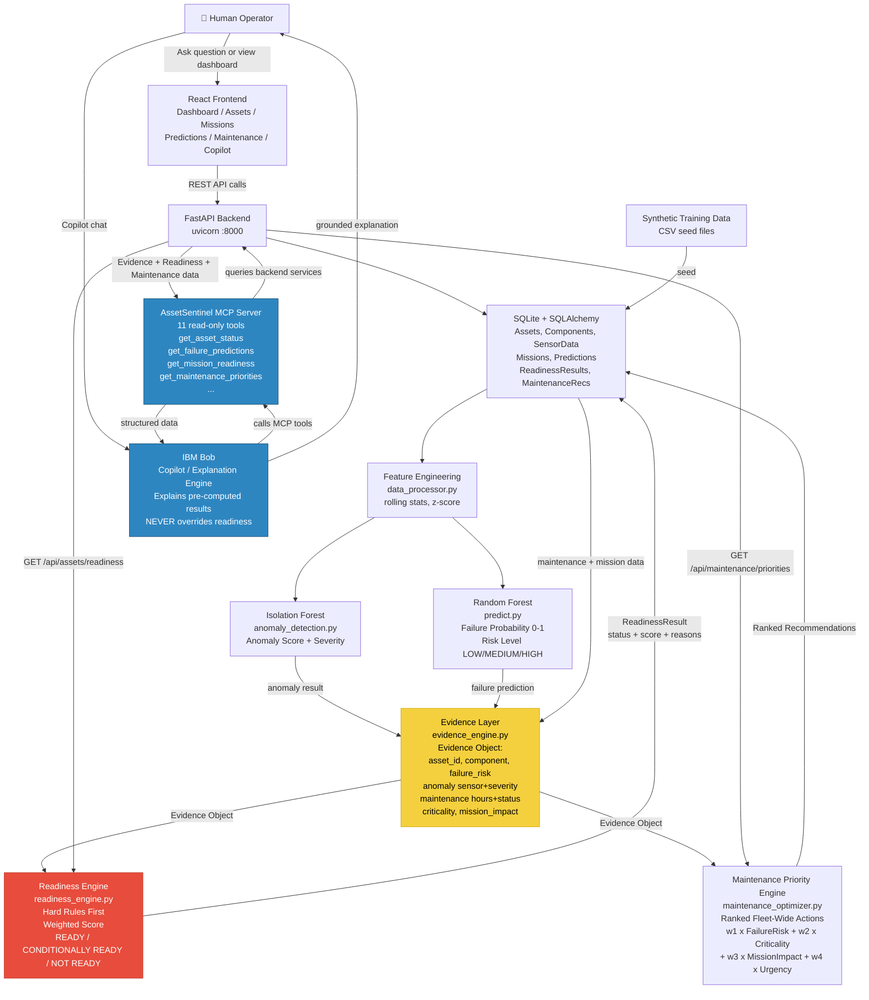

# AssetSentinel — Architecture

**Mission Readiness & Predictive Maintenance Copilot**
Team: Codecrafters | IBM Bob AI Hackathon

---

## System Architecture



---

## Core Principle

```
ML detects → Evidence proves → Readiness Engine decides → Maintenance Engine prioritizes → IBM Bob explains
```

**IBM Bob NEVER decides whether an asset is ready. The Readiness Engine is the sole authority.**

**React NEVER calculates readiness. It renders backend-computed results only.**

---

## Component Table

| Component | File | Responsibility |
|---|---|---|
| Feature Engineering | `services/data_processor.py` | Compute rolling stats, z-scores from SensorData |
| Anomaly Detection | `ml/anomaly_detection.py` | Isolation Forest — detect deviations from asset's own baseline |
| Failure Prediction | `ml/predict.py` | Random Forest — predict failure probability 0–1 per component |
| **Evidence Layer** | `services/evidence_engine.py` | Assemble Evidence object from ML + maintenance + mission data |
| **Readiness Engine** | `services/readiness_engine.py` | Hard rules first, then weighted score → READY/CONDITIONALLY READY/NOT READY |
| Maintenance Optimizer | `services/maintenance_optimizer.py` | Rank fleet maintenance actions by priority score |
| FastAPI App | `app/main.py` | Route registration, CORS, startup |
| API Routes | `api/assets.py` etc. | 16 REST endpoints wired to services |
| SQLAlchemy Models | `db/models.py` | 8 database tables |
| Pydantic Schemas | `schemas/*.py` | API request/response contracts (separate from ORM) |
| **AssetSentinel MCP** | `mcp/server.py` | 11 read-only tools for IBM Bob |
| React Frontend | `frontend/src/pages/*.tsx` | 7 pages rendering backend data |
| Configuration | `app/config.py` | Readiness weights + thresholds (single source of truth) |

---

## Readiness Score Formula

```
Readiness Risk Score =
    0.40 × Failure Risk
  + 0.25 × Anomaly Severity
  + 0.20 × Component Criticality
  + 0.15 × Mission Impact

Thresholds:
  0.00 – 0.34  →  READY
  0.35 – 0.66  →  CONDITIONALLY READY
  0.67 – 1.00  →  NOT READY
```

Hard rules execute **before** the score (override to NOT READY immediately):
- Mandatory inspection overdue on critical component
- Critical component failure risk > hard threshold (e.g. 0.85)
- Mission-required component unavailable/non-functional

---

## End-to-End Data Flow: Canonical Demo (AS-1047)

1. **Sensor Data**: AS-1047 vibration readings trend upward; last bearing service was 420 hours ago
2. **Feature Engineering**: Rolling z-score computed per sensor per asset baseline
3. **Isolation Forest**: Vibration z-score → anomaly score HIGH; `{sensor: "vibration", severity: "HIGH"}`
4. **Random Forest**: Feature vector → 0.87 failure probability; `{component: "main_bearing", risk_level: "HIGH"}`
5. **Evidence Layer**: Assembles `{asset_id: "AS-1047", component: "main_bearing", failure_risk: 0.87, risk_level: "HIGH", anomaly: {sensor: "vibration", severity: "HIGH"}, maintenance: {hours_since_service: 420, inspection_status: "OVERDUE"}, criticality: "HIGH", mission_impact: "HIGH"}`
6. **Readiness Engine (high-criticality mission)**: Hard rule fires — inspection OVERDUE on HIGH criticality component → **NOT READY**
7. **Readiness Engine (training mission)**: No hard rule; score = 0.40×0.87 + 0.25×1.0 + 0.20×1.0 + 0.15×0.5 ≈ 0.67 → **CONDITIONALLY READY**
8. **Maintenance Optimizer**: AS-1047 bearing inspection scores highest → ranked **#1**
9. **IBM Bob** (via MCP): Retrieves Evidence + both readiness results + maintenance rank → explains the full chain

---

## IBM Bob Integration

### MCP Tools (read-only)

| Tool | Returns |
|---|---|
| `get_asset_status(asset_id)` | Current status, last readiness result |
| `get_asset_details(asset_id)` | Full asset metadata and components |
| `get_sensor_trends(asset_id)` | Recent sensor readings with trend direction |
| `get_component_health(asset_id)` | Component status + service hours |
| `get_failure_predictions(asset_id)` | RF probability + risk level per component |
| `get_anomalies(asset_id)` | Isolation Forest results + severity |
| `get_maintenance_history(asset_id)` | Service records + overdue status |
| `get_mission_readiness(asset_id, mission_id)` | Mission-specific readiness result + evidence |
| `get_fleet_readiness()` | Fleet-wide readiness summary |
| `get_maintenance_priorities()` | Ranked maintenance recommendation list |
| `get_mission_details(mission_id)` | Mission requirements, criticality, threshold |

### Interaction Pattern

```
User asks Bob: "Why is AS-1047 not mission-ready?"

Bob calls:
  → get_asset_status("AS-1047")
  → get_failure_predictions("AS-1047")
  → get_anomalies("AS-1047")
  → get_mission_readiness("AS-1047", "mission-strike-01")
  → get_maintenance_priorities()

Bob explains:
  "The Readiness Engine determined AS-1047 is NOT READY for this mission.
   Evidence: Main bearing failure risk is 87% (HIGH). Vibration is significantly
   above AS-1047's historical baseline (HIGH anomaly). The bearing inspection is
   OVERDUE (420 hours since last service). This component is HIGH criticality
   for the mission. The hard rule — overdue inspection on a critical component —
   triggered NOT READY before the weighted score was even calculated.
   Recommended action #1: Inspect and replace main bearing."
```

**Bob's role**: Explain. Not decide.

---

## Security and Trust Notes

- All data is **synthetic** — no real operational or classified data
- This is a **decision-support prototype** for human operators; not autonomous control
- No safety certification or military-grade security is claimed
- Readiness verdicts are visible to human operators who retain final authority
- No credentials or secrets are committed to the repository
- IBM Bob cannot override the Readiness Engine verdict

---

## Technology Stack

| Layer | Technology |
|---|---|
| Frontend | React 18, TypeScript, Vite, Tailwind CSS, Recharts, Axios |
| Backend | Python 3.11+, FastAPI, Uvicorn, Pydantic v2 |
| Database | SQLite, SQLAlchemy 2.0 |
| Data Processing | Pandas, NumPy |
| Machine Learning | scikit-learn (RandomForest, IsolationForest) |
| IBM Integration | IBM Bob via AssetSentinel MCP Server |
