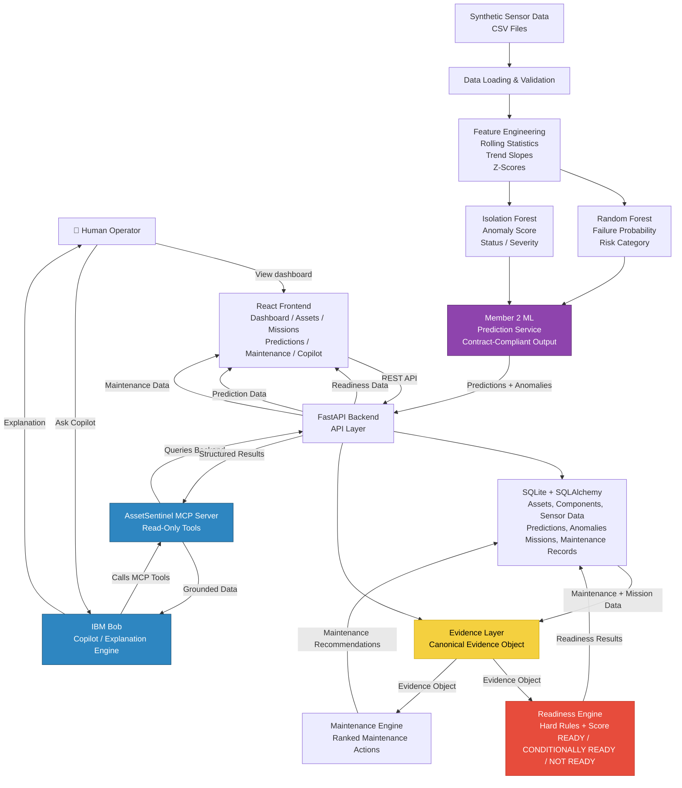

# AssetSentinel — Architecture

**Mission Readiness & Predictive Maintenance Copilot**

Team: Codecrafters | IBM Bob AI Hackathon

---

## System Architecture



---

## Core Principle

```text
ML detects
    ↓
Evidence combines context
    ↓
Readiness Engine decides
    ↓
Maintenance Engine prioritizes
    ↓
IBM Bob explains
```

**IBM Bob NEVER decides whether an asset is ready. The Readiness Engine is the authority for readiness decisions.**

**React NEVER calculates readiness. It renders backend-computed results.**

**Member 2 ML NEVER calculates readiness, mission scores, RUL, or maintenance recommendations.**

---

# Module Responsibilities

## Member 1 — Backend

Responsible for:

- FastAPI APIs
- Database integration
- SQLAlchemy models
- Pydantic schemas
- Prediction and anomaly APIs
- Runtime integration between modules

Member 1 exposes APIs for prediction data such as:

```text
GET /predictions/
GET /predictions/asset/{id}
GET /predictions/anomalies
GET /predictions/anomalies/asset/{id}
```

---

## Member 2 — Machine Learning

Responsible for:

- Synthetic sensor data
- Data loading and validation
- Feature engineering
- Random Forest failure prediction
- Isolation Forest anomaly detection
- ML prediction service

Member 2 provides:

### Random Forest Output

```text
prediction_id
asset_id
component_id
failure_probability
risk_category
timestamp
```

### Isolation Forest Output

```text
asset_id
component_id
anomaly_score
anomaly_status
anomaly_severity
sensor
timestamp
```

Member 2 uses real trained model artifacts.

Models are loaded during prediction.

Models are NOT retrained during prediction.

Member 2 does NOT implement:

- FastAPI
- Database logic
- Evidence Layer
- Readiness scoring
- Mission evaluation
- Maintenance recommendations
- RUL
- Frontend logic

---

## Member 3 — Evidence and Readiness

Responsible for:

- Evidence Layer
- Canonical Evidence Object
- Readiness evaluation
- Maintenance prioritization
- Mission-related decisions

Member 3 consumes ML output as evidence.

The Evidence Layer combines:

- Failure probability
- Risk category
- Anomaly score
- Anomaly status
- Anomaly severity
- Sensor
- Maintenance information
- Component criticality
- Mission information

The ML output itself is not modified or recalculated.

---

## Frontend

Responsible for:

- Dashboard
- Asset views
- Prediction views
- Anomaly views
- Maintenance views
- Readiness views
- Copilot interface

The frontend consumes backend APIs.

The frontend does NOT calculate:

- ML predictions
- Readiness scores
- Maintenance priorities

---

# Machine Learning Architecture

```text
Synthetic / Sensor Data
        │
        ▼
Data Loading & Validation
        │
        ▼
Feature Engineering
        │
        ├───────────────────────┐
        │                       │
        ▼                       ▼
Random Forest            Isolation Forest
Failure Prediction       Anomaly Detection
        │                       │
        │                       │
        └───────────┬───────────┘
                    │
                    ▼
          ML Prediction Service
                    │
                    ▼
        Contract-Compliant Output
                    │
                    ▼
              Backend
```

---

# Feature Engineering

The ML pipeline transforms raw sensor readings into meaningful historical behavior features.

Sensors include:

- Vibration
- Temperature
- Pressure
- RPM

Engineered behavior indicators can include:

- Latest value
- Rolling mean
- Rolling standard deviation
- Maximum value
- Trend slope
- Maximum z-score

These features allow the models to analyze sensor behavior over time.

---

## Important ML Rule

The following identifiers are NOT used as ML model features:

```text
asset_id
component_id
prediction_id
timestamp
```

Identifiers are used only for:

- Metadata
- Component lookup
- Final output
- Integration

This prevents the ML models from memorizing specific assets or components.

---

# Random Forest

## Responsibility

Random Forest predicts component failure risk.

## Output

```text
failure_probability
risk_category
```

### Failure Probability

Range:

```text
0.0 to 1.0
```

### Risk Categories

```text
LOW
MEDIUM
HIGH
```

The probability is generated using:

```python
RandomForestClassifier.predict_proba()
```

The probability is generated through real model inference.

It is NOT hardcoded.

---

# Isolation Forest

## Responsibility

Isolation Forest detects unusual component sensor behavior.

## Output

```text
anomaly_score
anomaly_status
anomaly_severity
sensor
```

### Anomaly Status

Contract-defined values:

```text
NORMAL
HIGH
```

Raw Isolation Forest values are not exposed directly.

---

# Sensor Identification

Isolation Forest provides a component-level anomaly result.

AssetSentinel also determines which sensor shows the strongest abnormal behavior.

The system evaluates engineered behavior for:

```text
vibration
temperature
pressure
RPM
```

Indicators can include:

- Maximum z-score
- Trend slope
- Latest value compared with rolling mean

The final sensor output is one of:

```text
vibration
temperature
pressure
RPM
NONE
```

---

# Anomaly Severity

Anomaly severity values are:

```text
LOW
MEDIUM
HIGH
```

Severity is determined using centralized deterministic thresholds based on the magnitude of abnormal sensor behavior.

For example:

```text
NORMAL
    ↓
LOW

Moderate abnormal behavior
    ↓
MEDIUM

Strong abnormal behavior
    ↓
HIGH
```

---

# ML Prediction Service

The Member 2 ML module provides a reusable prediction interface.

Public functionality supports:

```text
Single component prediction
```

and:

```text
All component prediction
```

The prediction service:

1. Loads trained Random Forest artifacts
2. Loads trained Isolation Forest artifacts
3. Loads saved feature column definitions
4. Reuses the existing feature engineering pipeline
5. Runs real model inference
6. Produces contract-compliant results

Models are cached where appropriate to avoid unnecessary repeated loading.

---

# Contract-Compliant ML Result

The combined internal prediction result contains the information required by the shared contract.

Example:

```json
{
  "prediction_id": "PRED-XXXXXXX",
  "asset_id": "AS-1047",
  "component_id": "BRG-1047",
  "failure_probability": 0.899,
  "risk_category": "HIGH",
  "anomaly_score": -0.056,
  "anomaly_status": "HIGH",
  "anomaly_severity": "HIGH",
  "sensor": "vibration",
  "timestamp": "2026-09-13T09:50:36+00:00"
}
```

The backend can separate the Random Forest and Isolation Forest fields when storing or exposing them.

---

# Evidence Layer Architecture

```text
Member 2 ML Output
        │
        ▼
Failure Prediction
+
Anomaly Detection
        │
        ▼
Member 3 Evidence Layer
        │
        ├── Maintenance Status
        ├── Component Criticality
        └── Mission Information
        │
        ▼
Canonical Evidence Object
```

The Evidence Layer combines ML evidence with operational context.

ML does not calculate the final readiness decision.

---

# Readiness Architecture

```text
Canonical Evidence Object
        │
        ▼
Hard Rules
        │
        ├── Critical inspection overdue
        ├── Critical component risk threshold exceeded
        └── Required component unavailable
        │
        ▼
Readiness Score
        │
        ▼
READY
CONDITIONALLY READY
NOT READY
```

The Readiness Engine is responsible for the final readiness decision.

---

# Maintenance Architecture

```text
Evidence Object
        │
        ▼
Failure Risk
+
Criticality
+
Mission Impact
+
Maintenance Context
        │
        ▼
Maintenance Priority Engine
        │
        ▼
Ranked Maintenance Actions
```

The ML module provides evidence.

The Maintenance Engine determines priorities.

---

# End-to-End Data Flow

```text
Sensor Data
        │
        ▼
Data Loading
        │
        ▼
Validation
        │
        ▼
Feature Engineering
        │
        ├───────────────┐
        │               │
        ▼               ▼
Random Forest      Isolation Forest
        │               │
        └───────┬───────┘
                │
                ▼
        ML Prediction Service
                │
                ▼
          Member 1 Backend
                │
                ▼
          Member 3 Evidence
                │
                ▼
          Readiness Engine
                │
                ▼
        Maintenance Engine
                │
                ▼
          FastAPI APIs
                │
                ▼
          React Frontend
```

---

# Canonical Demo Flow — AS-1047

## 1. Sensor Behavior

AS-1047 contains increasing vibration behavior associated with its bearing component.

---

## 2. Feature Engineering

The system calculates historical sensor behavior indicators such as:

- Rolling statistics
- Trend slope
- Maximum z-score
- Latest value compared with historical behavior

---

## 3. Random Forest

The trained Random Forest performs real inference.

Example result:

```text
failure_probability ≈ 0.899
risk_category = HIGH
```

---

## 4. Isolation Forest

The trained Isolation Forest performs anomaly inference.

Example result:

```text
anomaly_status = HIGH
anomaly_severity = HIGH
sensor = vibration
```

The sensor is determined from engineered behavior indicators.

There is no rule such as:

```python
if asset_id == "AS-1047":
```

The result emerges from the data and model inference.

---

## 5. Backend

The backend receives the prediction and anomaly results.

It exposes the information through prediction APIs.

---

## 6. Evidence Layer

The Evidence Layer combines:

```text
Failure Risk
+
Anomaly Information
+
Maintenance Context
+
Component Criticality
+
Mission Information
```

This produces the canonical Evidence Object.

---

## 7. Readiness Engine

The Readiness Engine evaluates:

- Hard rules
- Evidence
- Readiness scoring

It produces one of:

```text
READY
CONDITIONALLY READY
NOT READY
```

---

## 8. Maintenance Engine

The Maintenance Engine uses operational evidence to prioritize maintenance actions.

---

## 9. Frontend

The React frontend displays:

- Predictions
- Anomalies
- Readiness
- Maintenance priorities
- Asset information

---

# IBM Bob Integration

## IBM Bob Role

IBM Bob is used as an AI-assisted development and project workflow environment.

IBM Bob supports the development process while the AssetSentinel system maintains clear architectural boundaries between:

- Backend
- Machine Learning
- Evidence Layer
- Readiness
- Maintenance
- Frontend

IBM Bob is not the authority for readiness decisions.

The Readiness Engine remains responsible for readiness evaluation.

---

# MCP Integration

The AssetSentinel MCP Server provides read-only access to structured system information.

Example tool categories include:

```text
Asset Status
Asset Details
Sensor Trends
Component Health
Failure Predictions
Anomalies
Maintenance History
Mission Readiness
Fleet Readiness
Maintenance Priorities
Mission Details
```

The flow is:

```text
User
  ↓
IBM Bob
  ↓
MCP Tools
  ↓
Backend Services
  ↓
Structured Asset Data
  ↓
IBM Bob Explanation
  ↓
User
```

---

# Core Principle

```text
ML detects
        ↓
Evidence combines
        ↓
Readiness Engine decides
        ↓
Maintenance Engine prioritizes
        ↓
IBM Bob explains
```

### Important Architectural Rules

**ML detects risk and anomalies.**

**Evidence Layer combines ML and operational context.**

**Readiness Engine decides readiness.**

**Maintenance Engine prioritizes maintenance.**

**IBM Bob explains system results.**

**React renders backend-computed results.**

---

# Component Table

| Component | Location / Module | Responsibility |
|---|---|---|
| Data Loading | Member 2 ML | Load and validate sensor data |
| Feature Engineering | Member 2 ML | Generate historical sensor behavior features |
| Random Forest | Member 2 ML | Predict failure probability and risk category |
| Isolation Forest | Member 2 ML | Detect anomalies and anomaly severity |
| Prediction Service | Member 2 ML | Provide reusable contract-compliant ML predictions |
| Backend | Member 1 | APIs, database integration, prediction persistence |
| Evidence Layer | Member 3 | Combine ML and operational evidence |
| Readiness Engine | Member 3 | Evaluate readiness using evidence and rules |
| Maintenance Engine | Member 3 | Rank maintenance actions |
| FastAPI | Member 1 | Backend API layer |
| SQLAlchemy Models | Member 1 | Database models |
| Pydantic Schemas | Member 1 | API request and response validation |
| MCP Server | Integration Layer | Read-only access to structured system information |
| IBM Bob | IBM Integration | Development assistance and grounded system interaction |
| React Frontend | Frontend | User interface and dashboard |

---

# Technology Stack

| Layer | Technology |
|---|---|
| Frontend | React, TypeScript, Vite, Tailwind CSS, Recharts, Axios |
| Backend | Python, FastAPI, Uvicorn, Pydantic |
| Database | SQLite, SQLAlchemy |
| Data Processing | Pandas, NumPy |
| Machine Learning | scikit-learn |
| Failure Prediction | Random Forest |
| Anomaly Detection | Isolation Forest |
| IBM Technology | IBM Bob |
| Integration | REST APIs, MCP |
| Development | Git, GitHub |

---

# Security and Trust Notes

- All project data is synthetic.
- No real operational or classified data is used.
- AssetSentinel is a decision-support prototype.
- The system does not autonomously control assets.
- Human operators retain final authority.
- ML predictions are treated as evidence, not autonomous decisions.
- Readiness decisions are produced by the Readiness Engine.
- IBM Bob does not override readiness decisions.
- The frontend does not calculate readiness.
- No credentials or secrets should be committed to the repository.